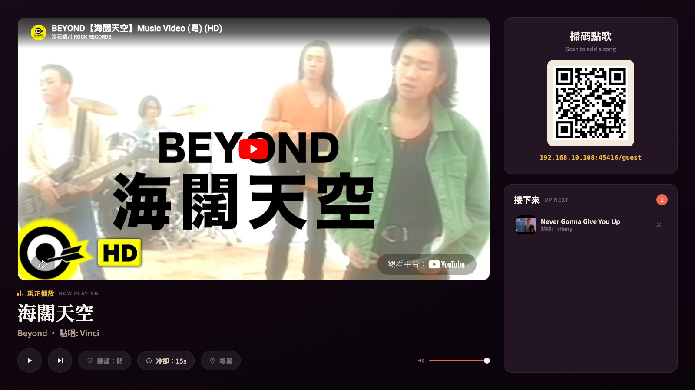
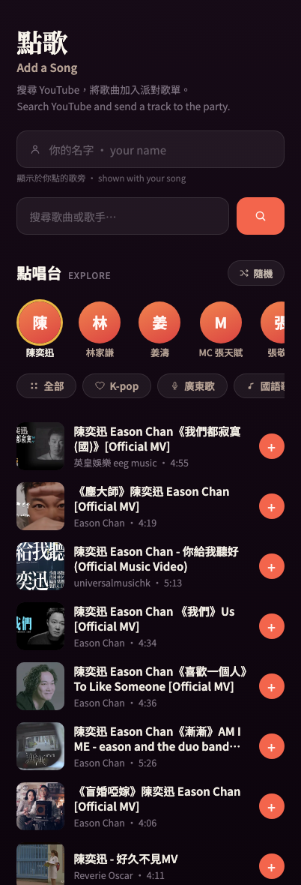

<div align="center">

# 🎶 Event Music System

**Turn any projector into a crowd-powered jukebox.**

Guests scan a QR code, search YouTube from their phones, and queue songs.
The music plays on the big screen — with an optional AI DJ that keeps requests
fit for the occasion, whatever the occasion is.

[](https://bun.sh)
[](LICENSE)
[](#how-it-works)
[](#run-on-a-home-server-docker--reverse-proxy)



<em>The projected host screen: player, scan-to-add QR, live queue with requester credits.</em>

</div>

## Why this exists

Party playlists die in one of two ways: one person DJs all night, or an
unmoderated queue fills with memes and worse. This is the middle path — every
guest can add songs from their own phone in seconds (no app, no account), while
the host keeps light-touch control: skip, remove, rate-limit, and an optional
LLM filter that understands *"this is a school dinner"* vs *"this is a
nightclub"* and judges requests accordingly.

Built for a real graduation dinner in Hong Kong; designed to work for any event.

## Features

- 📱 **Zero-friction requests** — scan QR → search → tap. No app, no login.
- 🔑 **No YouTube API key** — search scrapes the public results page; playback
  uses the standard embedded player.
- 🎤 **KTV-style explore** — genre tabs (K-pop, Cantopop, Mandopop, Western,
  party, HK classics) and singer chips with live, real results — guests who
  don't know what to pick just tap.
- 🤖 **AI content filter (optional)** — any OpenAI-compatible LLM judges each
  request against *your event*, enriched with the video's YouTube category,
  family-safe flag, and description. Three modes cycled from the host page:
  **off / on / strict**. Fails open on outages — moderation can never stop the
  music.
- 🎛 **Host controls, live** — play/pause/skip, volume, remove tracks, per-guest
  request cooldown, filter mode, and the event description fed to the AI — all
  from the projected page, all persisted across restarts.
- 🔒 **Host password** — optional login gates the projector page *and* its
  WebSocket controls; guests are unaffected.
- 🛡 **Queue guardrails** — duplicate rejection, per-phone cooldown (works
  behind venue NAT), 50-song cap, playability pre-check, and a watchdog that
  skips videos that fail to start.
- ⚡ **Live everything** — one WebSocket broadcast keeps the projector and every
  phone in sync; guests see a "你 (YOU)" badge on their own songs.

<div align="center">


<em>The guest page on a phone: name, search, singer chips, one-tap requests.</em>
</div>

## Quick start

```bash
git clone https://github.com/Hangton-Code/event-music-system.git
cd event-music-system
bun install
cp .env.example .env      # defaults are fine — the AI filter is off
bun start
```

Open **http://localhost:45416/** on the machine, drag it to the projector, and
click **Start** once to unlock audio. Guests scan the on-screen QR code.

> Node ≥ 20 works too (`npm install && npm start`), but Bun is what the Docker
> image and scripts use.

## How it works

```
   Projector (laptop / server)        Guests' phones
  ┌────────────────────┐             ┌──────────────┐
  │  ▶ Now Playing     │   scan QR   │  🔍 search   │
  │  [ YouTube video ] │  ◀───────▶  │  + add song  │
  │  ▣ QR   Up Next ▤▤ │   Wi-Fi     │  live queue  │
  └────────────────────┘             └──────────────┘
            │ audio out → venue AV system
```

| Path | Purpose |
|------|---------|
| `/` | Host/projector page — player, QR code, queue, controls |
| `/guest` | Mobile page guests open via the QR |
| `GET /api/search?q=` | Scrapes YouTube search results (no API key) |
| `GET /api/browse?q=` | Cached, singles-only search behind the explore tabs |
| `POST /api/request` | Guardrails → playability check → (optional AI filter) → enqueue |
| WebSocket `/` | Broadcasts queue state; carries host controls |

The **server owns the queue** (`src/state.js`). The host page is just a player:
when a track ends or errors, it tells the server, which promotes the next song
and broadcasts the new state to everyone. Host-page settings (filter mode,
cooldown, event context) persist in `data/settings.json`.

Request pipeline: flood control → duplicate/cap checks → oEmbed playability
check → optional LLM verdict → enqueue. Embed-disabled or region-locked videos
that slip through are auto-skipped by the player (iframe error codes + a 20s
never-started watchdog).

## The AI filter

Off by default; cycle it from the host page (🛡 過濾 pill): **off → on →
strict**. It works with any **OpenAI-compatible** chat API — OpenRouter,
Kimi/Moonshot, DeepSeek, GLM… swap providers by changing three `.env` values,
no code changes:

```ini
LLM_API_KEY=sk-...
LLM_BASE_URL=https://openrouter.ai/api/v1
LLM_MODEL=deepseek/deepseek-v4-flash
```

Verify a key and list models with `bun run check-llm`.

**Context-aware, not puritanical.** Tell it what the event is (場景 button on
the host page — e.g. *"a wedding banquet"*, *"a nightclub party"*) and it sets
the bar accordingly: explicit mainstream tracks pass at a club but not at a
school dinner; national anthems and protest songs get caught at ordinary social
events. **Strict** mode ignores the venue and allows family-friendly music only.

Failure design worth knowing:

- **Fails open** on infrastructure problems (no key, HTTP error, timeout) — an
  outage never stops the party.
- **Fails closed** when the model answers but dodges the question (provider
  content-filter, no structured verdict) — evasion is treated as a rejection.

> The filter reads title, channel, category, and description — not the audio.
> By default it catches non-music and explicit metadata, not explicit lyrics
> hidden under a clean title. On OpenRouter, set `LLM_WEB_SEARCH=true` to close
> that gap: the model web-searches each song and judges the actual lyrics
> (~$0.005 per moderated request, a few seconds slower).

## Run on a home server (Docker + reverse proxy)

The server builds the image itself from source — no registry, no logins:

```bash
git clone https://github.com/Hangton-Code/event-music-system.git
cd event-music-system
cp .env.example .env          # set PUBLIC_URL to your domain, HOST_PASSWORD too
docker compose up -d --build
```

The container joins the external `reverseproxy` Docker network and exposes port
`45416`. Point your reverse proxy at `event-music:45416`, set `PUBLIC_URL` to
your domain (the QR code guests scan uses it), and make sure the proxy forwards
**WebSocket upgrades**. Host-page settings persist in `./data`.

> The `reverseproxy` network must already exist (it does if your proxy created
> it). If not: `docker network create reverseproxy`.

### Keeping it updated

**Push-to-deploy (recommended)** — a self-hosted GitHub Actions runner rebuilds
on every push to `main` (`.github/workflows/deploy.yml`). One-time setup:

1. **Register the runner** — repo → **Settings → Actions → Runners → New
   self-hosted runner**, pick Linux, run the shown commands on the home server
   as the user that owns your clone, then `sudo ./svc.sh install <youruser> &&
   sudo ./svc.sh start`.
2. **Docker access** — `sudo usermod -aG docker <youruser>` (re-login after).
3. **Clone location** — the workflow deploys `~/event-music-system` by default;
   set a repo Variable `DEPLOY_DIR` if yours lives elsewhere.

**Manual** — `git pull && docker compose up -d --build` whenever you like.
**Cron** — `update.sh` pulls and rebuilds only when something changed (use the
runner *or* cron, not both).

> **Security note:** self-hosted runners + a public repo need care. This
> workflow triggers only on direct pushes to `main` and manual dispatch — never
> on `pull_request` — so forks can't execute code on your runner. Keep it that
> way.

## ⚠️ The #1 thing that breaks at events: the network

Guests' phones must be able to reach the server. Many **venue/guest Wi-Fi
networks block device-to-device traffic** ("client isolation"), so the QR code
loads nothing even though everything is configured correctly.

Reliable fixes (pick one):

- **Host it publicly** behind a domain (the Docker setup above) — phones use
  their own data; nothing to debug at the venue.
- **Run your own hotspot** and have guests join it.
- **Bring a travel router** and put everyone on its network.

The host machine always needs internet for YouTube playback.

## Configuration

Everything lives in `.env` (see [`.env.example`](.env.example) for the full,
commented list). The highlights:

| Variable | What it does |
|----------|--------------|
| `PUBLIC_URL` | Public address the QR code points to (behind a reverse proxy) |
| `HOST_PASSWORD` | Locks the projector page + controls (recommended when public) |
| `LLM_API_KEY` / `LLM_BASE_URL` / `LLM_MODEL` | Any OpenAI-compatible provider for the filter |
| `EVENT_CONTEXT` | Initial event description for the AI (editable live) |
| `PORT` | Listen port (default `45416`) |

Filter state, moderation mode, cooldown, and event context are all editable
from the host page at runtime and persist in `data/settings.json` — `.env` only
seeds the first boot.

## Project layout

```
server.js                  Express + WebSocket server, request pipeline, settings
src/youtube.js             No-key search scraping, oEmbed check, watch-page details
src/moderation.js          LLM content filter (OpenAI-compatible, fail-open)
src/state.js               Authoritative in-memory queue
src/net.js                 LAN IP detection
public/host.*              Projector page (player, QR, controls)
public/guest.*             Mobile page (search, explore, live queue)
scripts/check-llm.mjs      Verify LLM key + list models
Dockerfile                 Bun-based image
docker-compose.yml         Home-server deployment (builds locally)
update.sh                  Cron alternative: pull + rebuild if changed
```

No frameworks, no build step, three dependencies (`express`, `ws`, `qrcode`).
The whole thing is ~1,200 lines you can read in an afternoon.

## License

[MIT](LICENSE) — party responsibly. 🎉
